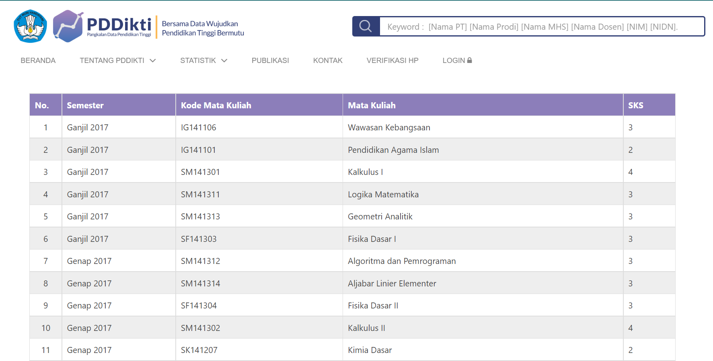
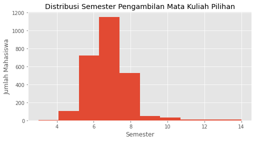
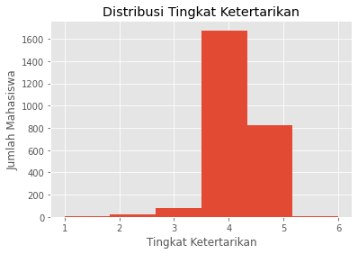
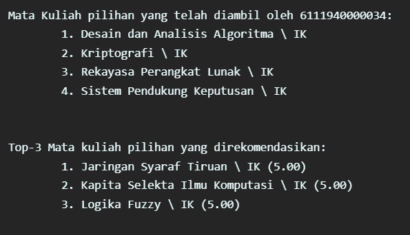
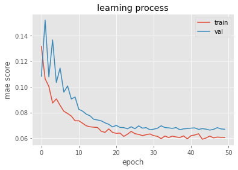
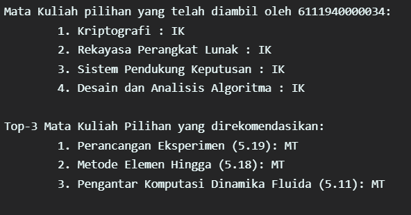
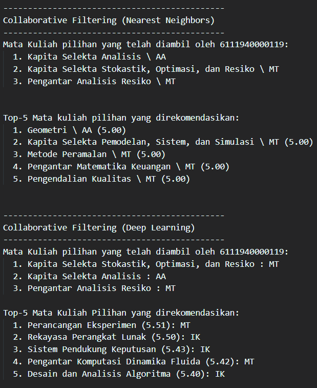
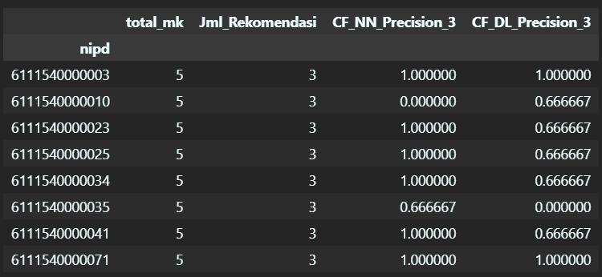

# Project Overview  

Menurut Kamus Besar Bahasa Indonesia (KBBI), mata kuliah adalah satuan pelajaran yang diajarkan di tingkat perguruan tinggi. Pada Program Studi Sarjana Matematika (PSSM) Institut Teknologi Sepuluh Nopember, mata kuliah disusun dalam bentuk mata kuliah wajib (inti) dan mata kuliah pilihan sesuai dengan bidang yang diikuti oleh mahasiswa. Mata kuliah wajib diberikan untuk memberikan dasar matematika dan sains yang kuat kepada mahasiswa dan mata kuliah umum. Mata kuliah dasar matematika meliputi mata kuliah yang disepakati oleh semua jurusan matematika (dalam hal ini dibahas dalam organisasi profesi IndoMS) dan mata kuliah yang menjadi ciri khas PSSM ITS. Mata kuliah wajib diberikan pada semester 1 sampai 8, sedangkan secara formal mata kuliah pilihan diberikan mulai semester 5. Mata kuliah pilihan dikelompokkan berdasarkan bidang keahlian (rumpun), yaitu Analisis dan Aljabar (AA), Matematika Terapan (MT), dan Ilmu Komputer (IK). Pada pemilihan mata kuliah wajib jika mengikuti [panduan kurikulum yang diberikan](https://www.its.ac.id/matematika/akademik/program-studi/sarjana/) relatif aman. 

Namun, dalam standar panduan tersebut hanya 18/19 SKS per semester. Ada kelebihan sampai 6 SKS yang dapat dimanfaatkan mahasiswa tertentu yang memiliki jatah pengambilan SKS lebih dari 18 SKS. Kelebihan ini dimanfaatkan dengan mengambil mata kuliah wajib semester atas atau bahkan bisa dengan mengambil beberapa mata kuliah pilihan awal terlebih dahulu. Disisi lain, kuota mahasiswa di kelas mata pilihan terbatas terbatas, sehingga tingkat persaingan ketat. Untuk bisa mencapai target kelulusan terkadang perlu menyiapkan / mengambil mata kuliah pilihan alternatif. Untuk mengatasi permasalahan ini, dapat dibangun sebuah sistem rekomendasi. Beberapa telah melakukan uji coba sistem rekomendasi mata kuliah pilihan seperti yang dilakukan [[1](https://openlibrarypublications.telkomuniversity.ac.id/index.php/engineering/article/view/2641/2507)]. Dalam penelitian tesebut membangun sistem rekomendasi mata kuliah pilihan dengan pendekatan metode aturan asosiasi (_association rule mining_) berdasarkan data historis mata kuliah dan nilai mahasiswa. Selain itu ada juga penelitian dengan pendekatan yang mirip, namun untuk kasus rekomendasi mata kuliah semester berikutnya, tidak spesifik untuk mata kuliah pilihan [[2](https://eltikom.poliban.ac.id/index.php/eltikom/article/view/549)]. Pada project ini akan mengimplementasikan pendekatan yang berbeda dengan penelitian yang telah disebutkan, yaitu dengan _Collaborative Filtering_ [[3](https://www.atlantis-press.com/proceedings/icitel-15/25850542)].

# Business Understanding  

Mahasiswa PSSM ITS akan masuk di satu rumpun utama. Namun, dari seluruh mata kuliah pilihan yang diambil tidak selalu dari rumpun utamanya. Bisa jadi ada 1-2 mata kuliah dari rumpun lain. Lebih spesifik, dalam project ini akan mencoba merekomendasikan mata kuliah pilihan yang relevan terhadap rumpun utama.  

## Problem Statements  

- Bagaimana memberikan rating/score sebagai syarat sistem rekomendasi yang diimplementasikan?
- Bagaimana menentukan rumpun utama seorang mahasiswa dari mata kuliah pilihan yang telah diambil?  
- Bagaimana memberikan rekomendasi mata kuliah pilihan yang relevan terhadap rumpun utama?  

## Goals  

- Dapat menentukan rating dari data yang tersedia
- Dapat menentukan rumpun utama yang dipilih mahasiswa  
- Dapat memberikan rekomendasi mata kuliah pilihan yang relevan terhadap rumpun utama mahasiswa  

  ### Solution statements
   
  Pada project ini, akan mencoba mengimplementasikan _Collaborative Filtering_ dengan metode:
  1. _Nearest Neighbors_, dengan mencari tetangga yang terdekat (_nearest neighbors_) dari seorang _user_, dimana data historis preferensi _user_ digunakan untuk menghitung jarak antar _user_. Secara sederhana tahapannya adalah dengan membuat _user_ rating matrix, kemudian menggenerate _nearest neighbor_-nya, lalu membuat rekomendasi yang relevan.

  2. _deep learning_, dengan memanfaatkan konsep _neural network_. Pada input layer, _user_ dan item dikodekan secara _one-hot-encoding_. Kemudian, mereka dipetakan ke _hidden layer_ dengan _embedding layer_ yang sesuai. Koneksi jaringan syaraf apapun dapat digunakan. Misalnya dengan _multi layer perceptron_, model mampu memperkirakan dengan baik interaksi kompleks antara _user_ dan item di ruang laten.

# Data Understanding  

Dataset pada project ini menggunakan data historis mata kuliah yang diambil oleh mahasiswa PSSM ITS tahun 2018-2021 dari situs [PDDikti](https://pddikti.kemdikbud.go.id/) seperti berikut:  

    

sampel data hasil crawling dapat diunduh di [sini](sample_data_kuliah_mat.csv).  
Dari dataset tersebut, berikut ini dekripsi variabel/fiturnya:  
* `kode_mk`: Kode mata kuliah  
* `nm_mk`: Nama mata kuliah  
* `id_smt`: tahun dan semester saat mata kuliah diambil oleh mahasiswa  
*	`nipd`: nomor induk mahasiswa  

# Data Preparation

Dari fitur awal yang tersedia dilakukan pemrosesan awal data sebagai berikut:
* Mengekstrak fitur baru (_Feature Engineering_):  
  * `tahun`: tahun saat pengambilan mata kuliah  
  * `jenis_smt`: ganjil / genap  
  * `smt`: semester ke-n saat mata kuliah diambil  
  * `rumpun`: rumpun yang tersedia (AA: Analisis Aljabar, IK: Ilmu Komputer, MT: Matematika Terapan), berdasarkan informasi dari situs [Departemen Matematika ITS](https://www.its.ac.id/matematika/akademik/program-studi/sarjana/)  
  
* Memfilter Mata Kuliah yang tidak tersedia dalam rumpun, seperti mata kuliah pengayaan / S2

Dari proses yang telah dilakukan diperoleh informasi bahwa mata kuliah pilihan paling cepat pernah diambil pada semester 3 dan terakhir bisa di semester 14. Namun, secara umum kebanyakan diambil di semester 6. Berikut ini plot distribusi pengambilan mata kuliah pilihan.

Selanjutnya, mengekstrak rating untuk keperluan pada pendekatan _collaborative filtering_. Karena tidak tersedia data rating secara eksplisit, maka pada project ini rating digantikan dengan tingkat ketertarikan. Fitur ini dihasilkan dengan ketentuan/asumsi sebagai berikut: 
  * Semester pengambilan awal pada semester ganjil  
  * Secara berurutan semester paling awal diberi rating tertinggi dan paling akhir rating terendah  
  * Dalam satu tahun (smt ganjil-genap) rating sama  
  * Tingkat ketertarikan pada range 1-6

Hasil pemberian tingkat ketertarikan sebagai berikut:
  
terlihat bahwa distribusi tingkat ketertarikan, cenderung miring kiri. Kebanyakan di tingkat ketertarikan 4

Sebelum masuk ditahapan pembentukan input _collaborative filtering_, fitur yang tidak digunakan lagi, yaitu `id_smt`, `tahun`,	`jenis_smt`, `smt` di drop terlebih dahulu.

## Pembuatan Sparse Matrix  

Sparse Matrix sebagai input untuk pendekatan dengan _nearest neighbor_. Fitur `nm_mk` dan `nipd`digunakan sebagai index matrix, dan fitur `tingkat_ketertarikan` sebagai isian nilai matrix. Contoh nya sebagai berikut:  
  

|   | 6111540000001	| 6111540000002 | 6111540000003 |  
|---| :---: | :---: | :---: |  
| Perancangan Eksperimen | 0 | 0 | 0 |  
| Persamaan Diferensial Parsial Numerik  | 0 | 0 | 0 |  
| Pengantar Analisis Resiko | 0 | 4 | 0 |  

## Encoding  

melakukan encoding fitur `nipd` dan `kode_mk`. Hasil encodingnya di petakan ke dataframe yang digunakan sebagai input, menghasilkan fitur `user` dan `mk`.

# Modelling  

Pada tahap ini, random seed diatur pada angka tertentu untuk lebih memudahkan _tracking_ dan kestabilan hasil.  

* _Nearest Neighbors_  
 Pada pendekatan ini _hyperparameter nearest negihbors_ yang diatur adalah _metric_ menggunakan 'cosine' (untuk menghitung jarang antar objek / user)dan _algorithm_-nya 'brute' (untuk mencari objek / user terdekat). 
 Dari pengaturan tersebut contoh hasil top rekomendasi yang dihasilkan sebagai berikut:  
  
  

* _Deep Learning Based_  
  Pada pendekatan ini _hyperparameter_ yang diatur diantaranya, nilai jumlah _embedding_, _epoch_, fungsi aktivasi, _embedding initialisizer_, _optimizer_, dan _learning rate_. Berikut ini hasil _learning process_-nya.
  
   

  Berikut ini contoh hasil rekomendasi yang dihasilkan:
  
   

# Evaluation  

Evaluasi model rekomendasi dilakukan dalam beberapa kasus jumlah pengambilan mata kuliah pilihan. **Minimal** seorang mahasiswa mengambil 6 mata kuliah pilihan, untuk itu evaluasi akan diberi batasan input mata kuliah yang diambil dari 1 - 5, dengan jumlah rekomendasi adalah sisa minimal mata kuliah yang harus diambil ditambah 2 (sebagai alternatif). contohnya sebagai berikut:  

  

Pengecekan kerelevan-an hasil rekomendasi dengan asumsi rumpun utama pilihan mahasiswa sesuai dengan mayoritas mata kuliah pilihan yang telah diambil. Kemudian kerelevan-an tersebut diukur dengan metrik presisi untuk setiap rekomendasi pada mahasiswa, seperti pada contoh berikut ini:  

  

Hasil tersebut kemudian di rata-rata untuk setiap kasus, didapatkan hasil akhir bahwa metode _Collaborative Filtering_ dengan _nearest neighbors_ lebih baik, selalu memiliki rata-rata presisi yang unggul dibanding dengan _deep learning_.

| N_MatPil_Diambil | N_Rekomendasi | Avg_CF_NN_Precision | Avg_CF_DL_Precision |
| :---: | :---: | :---: | :---: | 
| 1 | 7 | 59.45 | 50.23 |  
| 2 | 6 | 79.31 | 51.15 |  
| 3 | 5 | 73.47 | 41.63 |  
| 4 | 4 | 79.63 | 54.63 |  
| 5 | 3 | 80.61 | 66.67 |  

# Conclusion  

Dari project yang telah dilakukan, dari data publik historis pengambilan mata kuliah pilihan mahasiswa PSSM, dapat memberikan rating/score dari tingkat ketertarikan. Dimana tingkat ketertarikan ini diberikan berdasarkan historis urutan pemilihan mata kuliah pilihan tiap semesternya. Dari data tersebut dapat diperkirakan rumpun utama seorang mahasiswa PSSM ITS dengan melihat rumpun terbanyak dari mata kuliah pilihan yang telah diambil. Selanjutnya dapat diberikan rekomendasi yang relevan dengan rumpun utama dengan sistem rekomendasi _Collaborative Filtering_.

# References  

[1] Prasojo, S., Shaufiah, & Hidayati, H. (2015). Rekomendasi PengambilanMataKuliahPilihanMenggunakanRecursive EliminationAlgorithm(Relim). e-Proceeding of Engineering. 1631-1642. 

[2] Syahrul, A., & Solichin, A. (2022). Rekomendasi Pemilihan Mata Kuliah Dalam Pengisian Rencana Studi Mahasiswa dengan Penerapan Algoritma Apriori. Jurnal ELTIKOM : Jurnal Teknik Elektro, Teknologi Informasi Dan Komputer, 6(1), 79–88. https://doi.org/10.31961/eltikom.v6i1.549

[3] Wang, H., & Yu, G. (2016, March). Persomalized recommendation system K-neighbor algorithm optimization. In 2015 1st International Conference on Information Technologies in Education and Learning (icitel-15) (pp. 105-108). Atlantis Press.